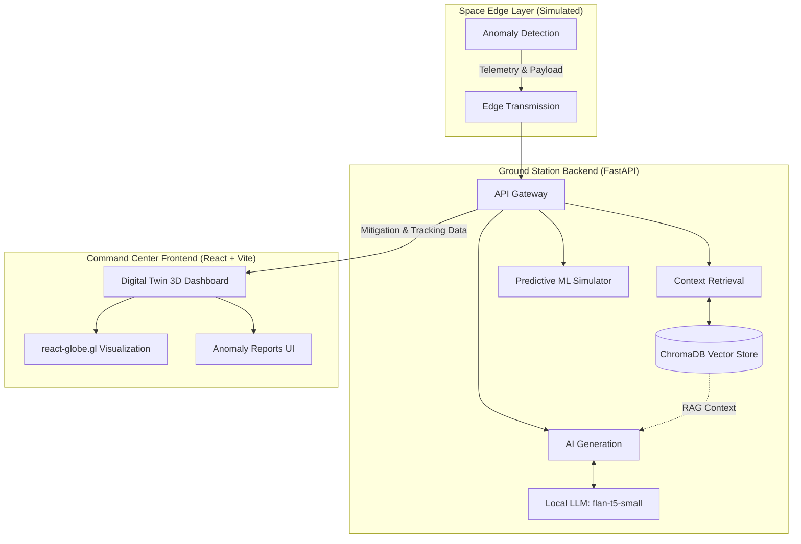

# Vyom OS

Vyom OS is an autonomous edge-to-ground station architecture designed to simulate and handle anomaly detection in satellite and space-layer systems. It combines predictive machine learning, localized RAG (Retrieval-Augmented Generation), and 3D visualization to act as a robust command center for tracking and mitigating anomalies.

## Architecture Overview

The system is composed of two primary layers:

### 1. Ground Station Backend (FastAPI + AI Models)
- **Framework:** FastAPI providing high-performance REST APIs.
- **Vector Database:** ChromaDB stores and retrieves relevant space mission research papers or logs for RAG.
- **Embeddings:** Uses `sentence-transformers` (`all-MiniLM-L6-v2`) to encode documents and queries.
- **Local LLM:** Uses Google's `flan-t5-small` model to autonomously generate mitigation strategies based on retrieved context (RAG) and anomaly reports.
- **Predictive ML:** Simulates anomaly spread and logistic growth over time to predict the severity of spatial events.

### 2. Command Center Frontend (React + Vite + 3D Visualization)
- **Framework:** React with TypeScript, bundled by Vite.
- **Styling:** Tailwind CSS with a custom, glassmorphic dark-mode UI.
- **Digital Twin 3D Visualization:** Uses `react-globe.gl` and `three` to render an interactive 3D globe plotting the coordinates and severity radii of anomalies in real-time.
- **Edge Simulation:** A Space Layer Simulator dashboard component that allows users to trigger mock edge transmissions to test the ground station's RAG and predictive capabilities.

## Workflow
1. **Edge Transmission:** A simulated satellite detects an anomaly and transmits a payload (type, location, severity, confidence) to the Ground Station.
2. **Context Retrieval:** The backend embeds the anomaly type and queries ChromaDB for relevant historical data/papers.
3. **AI Generation:** The context and anomaly details are passed to the local LLM to generate an autonomous mitigation report.
4. **Visualization:** The frontend plots the anomaly on the 3D digital twin and displays the generated intelligence report on the dashboard.
