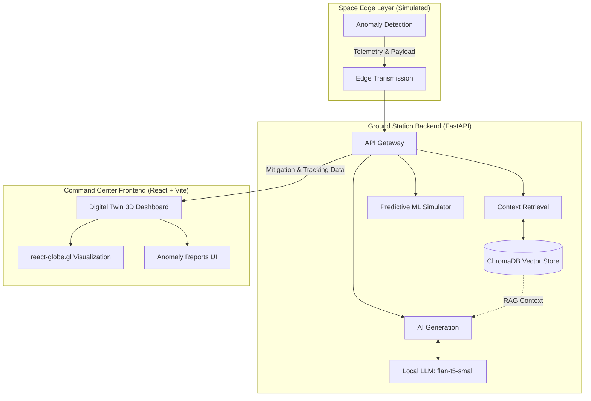

# VyomOS — Solar Flare Forecasting & Nowcasting System

### BAH 2026 Submission | Problem Statement: Solar Flare Forecasting using Aditya-L1

> AI-powered solar weather command center using Aditya-L1 SoLEXS/HEL1OS X-ray data,
> ML forecasting, RAG-augmented LLM advisories, and a real-time 3D digital twin
> of ISRO satellite orbital positions and solar threat exposure.

## Problem Statement

Forecasting and/or Nowcasting of Solar Flares using combined Soft and Hard X-ray
data from Aditya-L1 [BAH 2026 PS-XX]

## Key Features 🚀

- **Live 3D Digital Twin:** Real-time WebGL globe rendering ISRO satellites using live Celestrak TLE data (Aditya-L1, Chandrayaan-3, RESOURCESAT-2A, etc.).
- **Live Space Weather Monitoring:** Polling the NASA DONKI API to trigger simulated anomalies based on real-world Coronal Mass Ejections (CMEs) and Solar Flares.
- **Autonomous RAG Mitigation:** ChromaDB vector store loaded with actual ISRO Space Weather Advisory Protocols to ground LLM mitigation strategies in reality.
- **On-Device Edge Intelligence:** Zero cloud-dependency AI mitigation powered by a local FLAN-T5-small model.
- **Predictive Severity ML:** Logistic-growth based forecasting simulating anomaly spread and severity 72-hours into the future.
- **Multi-Satellite Correlation Engine:** Automatically draws pulsing connection arcs between satellites if a systemic space weather event hits multiple nodes within 15 minutes.
- **Data-Science Heatmaps:** Toggleable geographic heatmap displaying historical anomaly densities (e.g., highlighting the South Atlantic Anomaly).
- **Web Speech Voice Alerts:** Browser-native auditory warnings spoken aloud when critical anomalies are detected.
- **Telemetry Gauges:** Simulated real-time sensor dashboards tracking satellite Battery %, Solar Output (W), Temperature, and Signal Downgrade.

## Tech Stack 🛠️

**Frontend (Command Center)**
- **Framework:** React 18, TypeScript, Vite
- **Styling:** Tailwind CSS (Dark-mode Glassmorphism)
- **3D Visualization:** `react-globe.gl`, `three.js`
- **Charts & Data Viz:** `recharts`, `d3`
- **Orbital Propagation:** `satellite.js`

**Backend (Ground Station API)**
- **Framework:** FastAPI, Python 3.10+, Uvicorn
- **Data Validation:** Pydantic
- **Live Feeds:** `httpx` (NASA DONKI, Celestrak, NOAA GOES)

**AI & Machine Learning**
- **Vector Database:** ChromaDB
- **Embeddings:** HuggingFace `sentence-transformers` (`all-MiniLM-L6-v2`)
- **Local LLM:** Google `flan-t5-small`
- **Generative AI:** Gemini 3.5 Flash (for advisory chatbot and reporting)
- **Forecasting:** `scipy`, `numpy`, `scikit-learn`

GOES X-ray Flux (NOAA) | NASA DONKI | ISSDC Aditya-L1 Archive | Celestrak TLE

## Architecture Overview

The system is composed of two primary layers:

### 1. Ground Station Backend (FastAPI + AI Models)
- **Framework:** FastAPI providing high-performance REST APIs.
- **Vector Database:** ChromaDB stores and retrieves relevant space mission research papers or logs for RAG.
- **Embeddings:** Uses `sentence-transformers` (`all-MiniLM-L6-v2`) to encode documents and queries.
- **Local LLM:** Uses Google's `flan-t5-small` model to autonomously generate mitigation strategies based on retrieved context (RAG) and anomaly reports.
- **Predictive ML:** Simulates anomaly spread and logistic growth over time to predict the severity of spatial events.

### 2. Command Center Frontend (React + Vite + 3D Visualization)
- **Framework:** React with TypeScript, bundled by Vite.
- **Styling:** Tailwind CSS with a custom, glassmorphic dark-mode UI.
- **Digital Twin 3D Visualization:** Uses `react-globe.gl` and `three` to render an interactive 3D globe plotting the coordinates and severity radii of anomalies in real-time.
- **Edge Simulation:** A Space Layer Simulator dashboard component that allows users to trigger mock edge transmissions to test the ground station's RAG and predictive capabilities.

## Workflow
1. **Edge Transmission:** A simulated satellite detects an anomaly and transmits a payload (type, location, severity, confidence) to the Ground Station.
2. **Context Retrieval:** The backend embeds the anomaly type and queries ChromaDB for relevant historical data/papers.
3. **AI Generation:** The context and anomaly details are passed to the local LLM to generate an autonomous mitigation report.
4. **Visualization:** The frontend plots the anomaly on the 3D digital twin and displays the generated intelligence report on the dashboard.
